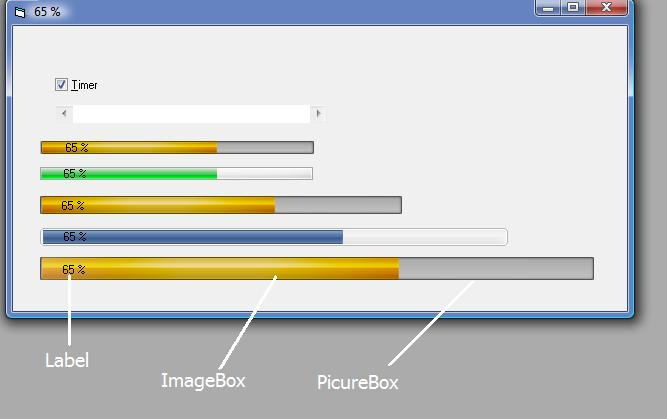

## MM Very Very simple Progressbar

### Description

Very simple Progressbar, a picturebox, an imagebox, a label and some line of codes and that's it:) no OCX and no API

you can change the look of the progressbar if you want, juste change the image in picture1 (representing the backGround of the progressbar) and the image in in image1 (representing the status and value of the progressbar) and that's it

Excuse my bad english
 
### More Info
 

             |
---                |---
**Submitted On**   |2009-02-05 11:50:02
**By**             |[Simo Simo](https://github.com/Planet-Source-Code/PSCIndex/blob/master/ByAuthor/simo-simo.md)
**Level**          |Beginner
**User Rating**    |4.7 (14 globes from 3 users)
**Compatibility**  |VB 5\.0, VB 6\.0
**Category**       |[Custom Controls/ Forms/  Menus](https://github.com/Planet-Source-Code/PSCIndex/blob/master/ByCategory/custom-controls-forms-menus__1-4.md)
**World**          |[Visual Basic](https://github.com/Planet-Source-Code/PSCIndex/blob/master/ByWorld/visual-basic.md)
**Archive File**   |[MM\_Very\_Ve214278252009\.zip](https://github.com/Planet-Source-Code/simo-simo-mm-very-very-simple-progressbar__1-71724/archive/master.zip)

